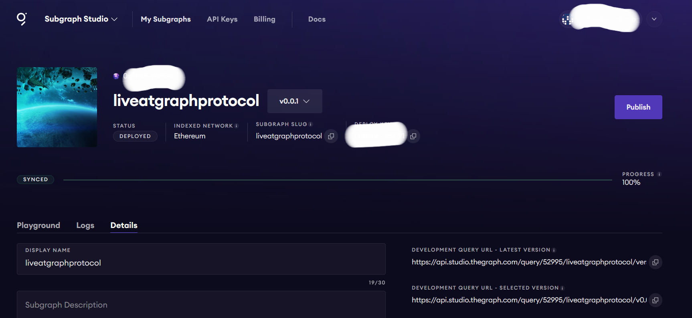

# MyCryptoPunkSubGraph

  <h3 align="center">MyCryptoPunkSubGraph</h3>
  
  

    A subgraph built on Ethereum to query Crypto Punks Blockchain.

 

## Table of contents

**1 [About the Project](#about-the-project)** 
**2 [Technical](#technical)** 
**3 [To Do List](#To-Do-List)** 
**4 [Contributing](#contributing)** 
**5 [Versions](#versions)** 
**6 [Contributors](#contributors)** 

:point_down: :point_down: :point_down: :point_down: :point_down:

## About the app

The project is to illustrates the creating and deploying of a subgraph that can be used to query the Crypto Punks Market. It was also used to expose use to the power of web3 and how it can be utilized.
The subgraph was not published because of lack of ethereum to publish it.

### Images

## Technical

### Permissions

1. Internet

### TECHNICAL

#### Dependencies/Configurations/Installations
Metamask Wallet
Graph CLI

## To Do List

- [x] Publish Subgraph.
- [x] Do some querying from a frontend.

## CONTRIBUTING
### Assets

[Subgraph studio](https://thegraph.com) 
[Miniscan](https://miniscan.xyz)

### Want to contribute?
I would/we'd love to have your help in making  **{this script (MyCryptoPunkSubGraph_liveatgraphprotocol)}** better. The subgraph has not been published yet, but if there's an issue you'd like to see addressed sooner rather than later, let me(/us) know. 

For any concerns, please open an [issue](https://github.com/SammyBloom/MyCryptoPunkSubGraph_liveatgraphprotocol/issues), or JUST, [fork the project and send a pull request](https://github.com/SammyBloom/MyCryptoPunkSubGraph_liveatgraphprotocol/pulls). 

## Versions 
* Version 1.0  DATE 17/9/2023

## Contributors
For personal feedback or questions feel free to contact me via the mail address, which is mentioned on my [Github profile](link (https://github.com/SammyBloom). If you have found any bugs or want to post a feature request please use the [bugtracker](https://github.com/SammyBloom/MyCryptoPunkSubGraph_liveatgraphprotocol/issues) to report them.

#### Developer
* e-mail: nwachiemi@gmail.com
* Twitter: [@SCNBloom](https://twitter.com/SCNBloom "SCNBloom")